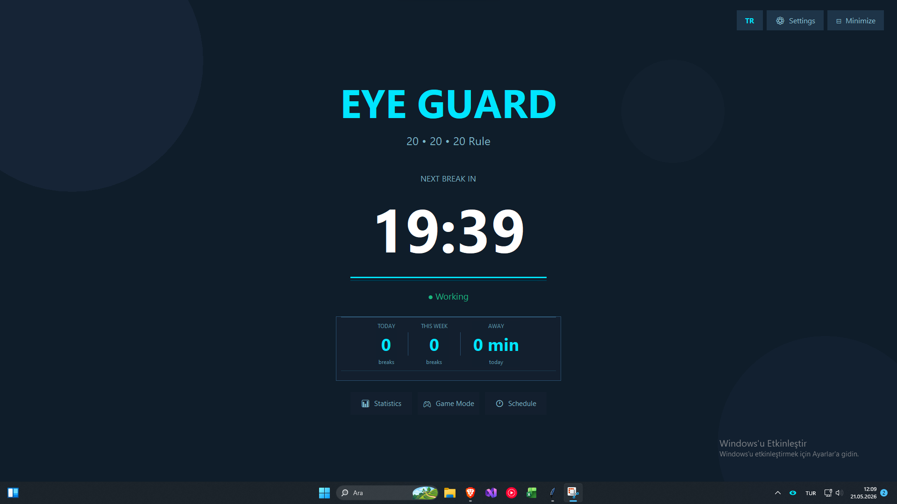
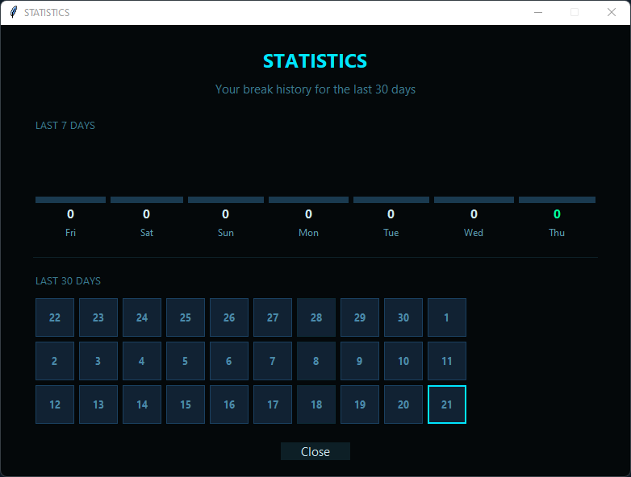
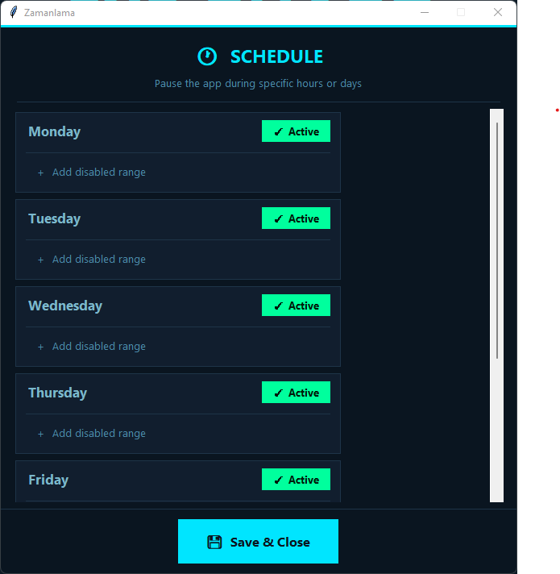
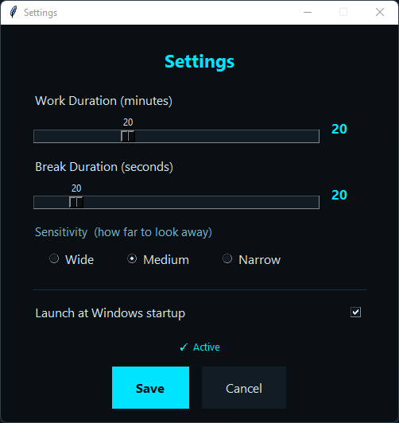
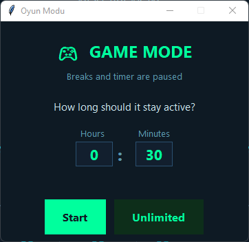
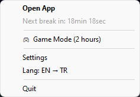

# 👁️ EyeGuard

<p align="center">
  
</p>

<p align="center">
  <b>A smart eye break reminder that enforces the 20-20-20 rule using real-time camera head tracking</b>
</p>

<p align="center">
  
  
  
  
</p>

---

## 📖 What is the 20-20-20 Rule?

Every **20 minutes**, look at something **20 feet away** for **20 seconds**.
This rule reduces eye fatigue and digital eye strain.

EyeGuard automates this — when break time comes, it locks your screen and **uses your camera to verify you're actually looking away.**

---

## ✨ Features

| Feature | Description |
|---|---|
| 📷 **Camera Tracking** | Uses MediaPipe to measure head angle and verify you're looking away |
| 🔔 **Sound Alerts** | Customizable sounds 60s before, at start, and at end of each break |
| 📊 **Statistics** | Daily/weekly break history with GitHub-style calendar heatmap |
| 🎮 **Game Mode** | Pause breaks for a set duration or indefinitely |
| 🕐 **Scheduler** | Enable/disable by day and time range |
| 🚀 **Auto-start** | Launches automatically at Windows startup |
| 🌐 **Bilingual** | Turkish and English support |
| 🎨 **Modern UI** | Dark theme, fullscreen panel |

---

## 🖥️ Screenshots

<p align="center">
  
  &nbsp;
  
</p>
<p align="center">
  
  &nbsp;
  
</p>
<p align="center">
  
  &nbsp;
  
</p>

---

## 🚀 Installation

### Ready-to-use EXE (Recommended)

1. Download `EyeGuard.exe` from the [Releases](https://github.com/Omerkaygisiz/eyeguard/releases) page
2. Place the `notifications` folder in the same directory as the EXE
3. Double-click to run

### Run with Python

**Requirements:**
- Python 3.12
- Windows 10/11

```bash
# Clone the repo
git clone https://github.com/Omerkaygisiz/eyeguard.git
cd eyeguard

# Create virtual environment (recommended)
python -m venv venv
venv\Scripts\activate

# Install dependencies
pip install -r requirements.txt

# Run
python eyeguard.py
```

### Build EXE

```bash
pip install pyinstaller
pyinstaller eyeguard.spec
# EyeGuard.exe will be in the dist/ folder
```

---

## 📁 File Structure

```
eyeguard/
├── eyeguard.py             # Main application
├── eyeguard.spec           # PyInstaller configuration
├── requirements.txt        # Python dependencies
├── notifications/          # Sound files
│   ├── warning.wav         # 60s warning sound
│   ├── break.wav           # Break start sound
│   └── done.mp3            # Break complete sound
├── eyeguard_stats.json     # Statistics data (auto-created)
└── eyeguard_schedule.json  # Schedule settings (auto-created)
```

---

## ⚙️ Settings

| Setting | Default | Description |
|---|---|---|
| Work Duration | 20 min | Time between breaks |
| Break Duration | 20 sec | How long to look away |
| Sensitivity | Medium | Head turn angle threshold |

**Sensitivity options:**
- **Wide** — Triggers only on large head movements
- **Medium** — Balanced
- **Narrow** — Triggers on small movements

---

## 🔧 Technical Details

- **Head tracking:** MediaPipe Face Mesh — yaw/pitch via 2D landmark geometry
- **UI:** Tkinter + Canvas
- **Tray:** pystray
- **Audio:** pygame
- **Data:** JSON files

---

## 🤝 Contributing

Pull requests are welcome!

1. Fork the repo
2. Create a feature branch (`git checkout -b feature/new-feature`)
3. Commit your changes (`git commit -m 'Add new feature'`)
4. Push to the branch (`git push origin feature/new-feature`)
5. Open a Pull Request

---

## 📄 License

This project is licensed under the [GNU General Public License v3.0](LICENSE).

In short: you can use, modify, and distribute this software — but derivative works must also be GPL-licensed.

---

## 👨‍💻 Developer

**Ömer Kaygısız** — [GitHub](https://github.com/Omerkaygisiz)

---

<p align="center">
  Protect your eyes 👁️
</p>
